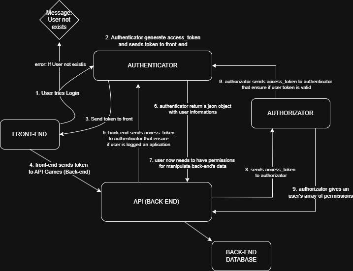

## Getting Started 

### Prerequisites

- PHP **8.2+**
- [Composer](https://getcomposer.org/)
- Laravel **12+**
- Postman (or similar API client)
- A valid OAuth2 Bearer Token

## Installation

```bash
composer install
cp .env.example .env
php artisan key:generate
php artisan migrate
```

## Running the server

```bash
php artisan serve
```

## Authentication

### All routes require authentication using a Bearer Token in the request header:

```http
Authorization: Bearer {your_token}
```

## Environment Configuration

### To enable authentication and authorization using external services, define the following variables in both `.env` and `.env.example`:

```env
AUTHENTICATOR="http://127.0.0.1:8000"
AUTHORIZATHOR="http://127.0.0.1:8001"
```

- **AUTHENTICATOR:** Validates the Bearer token and returns user info.
- **AUTHORIZATHOR:** Returns the user’s permissions for accessing specific routes.

## API Endpoints

### **GET** /games
**Retrieve all games.**

- **Request Body:** none
- **Response:**

```json
[
  {
    "id": 1,
    "name": "Game Title",
    "category": "Category",
    "year": 2020
  }
]
```

---

### **POST** /games
**Create a new game.**

- **Request Header:**
  - **HeaderX:** expected_value

- **Request Body:**

```json
{
  "name": "New Game",
  "category": "Adventure",
  "year": 2023
}
```

- **Response:**

```json
{
  "id": 2,
  "name": "New Game",
  "category": "Adventure",
  "year": 2023
}
```

---

### **GET** /games/{id}
**Retrieve a specific game by ID.**

- **Success Response:**

```json
{
  "id": 1,
  "name": "Game Title",
  "category": "Action",
  "year": 2020
}
```

- **Error Response:**

```json
{
  "message": "Game not found"
}
```

---

### **PUT** /games/{id}
**Update an existing game.**

- **Request Body:**

```json
{
  "name": "Updated Title",
  "category": "RPG",
  "year": 2024
}
```

- **Success Response:**

```json
{
  "id": 1,
  "name": "Updated Title",
  "category": "RPG",
  "year": 2024
}
```

- **Error Response:**

```json
{
  "message": "Game not found"
}
```

---

### **DELETE** /games/{id}
**Delete a game by ID.**

- **Success Response:**

```json
{
  "message": "Game successfully deleted"
}
```

- **Error Response:**

```json
{
  "message": "Game not found"
}
```

---

## Middleware and Security

### This project uses custom middleware to secure all requests:

- **Authenticator** – Verifies the validity of the Bearer token.
- **Authorizator** – Fetches route-based permissions from an external service.
- **Permission Checker** – Ensures the user has permission to access the current route.

### Possible Middleware Responses

```json
{
  "error": "Invalid token"
}
```

```json
{
  "error": "Unexpected error"
}
```

```json
{
  "error": "Permission denied"
}
```

---

### Architecture Diagram



---

## License

The Laravel framework is open-sourced software licensed under the [MIT license](https://opensource.org/licenses/MIT).